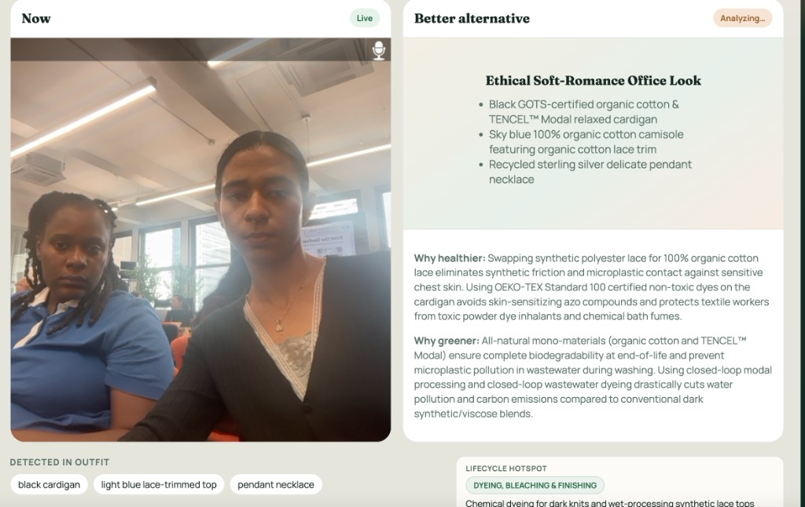
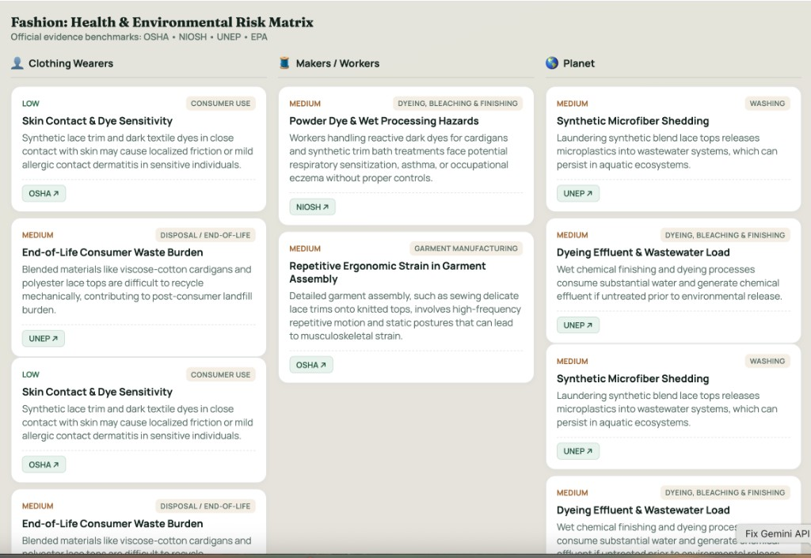

# LookShift MVP

Live fashion impact coach: watch an outfit on a **live video** call, get continuous **health + environmental** risk analysis, and see a **healthier, greener alternative outfit** on a split screen.

**Stack:** Vonage Video (live call) + Gemini multi-agent system (MAS).  
**Not used:** Google Cloud Vision (Gemini multimodal replaces it).  
**No sign-up / login** — room link + short-lived Vonage tokens only.

---

## Product UI

Split screen: **Now** (live outfit detection) | **Better alternative** (healthier / greener swap), with detected items and impact rationale.



### Fashion health & environmental risk matrix

Risks are framed across **clothing wearers**, **makers / workers**, and the **planet**, grounded in public benchmarks (OSHA • NIOSH • UNEP • EPA).



---

## Architecture (frontend + backend)

```
┌──────────────────────────────────────────────────────────────────────────┐
│                         FRONTEND  (apps/web)                             │
│                                                                          │
│  Split screen                                                            │
│  ┌─────────────────────────┐  ┌───────────────────────────────────────┐  │
│  │ LEFT — Now              │  │ RIGHT — Better alternative            │  │
│  │ Live Vonage video       │  │ AI alternative outfit (image/card)    │  │
│  │ (current outfit)        │  │ + why healthier / greener             │  │
│  └─────────────────────────┘  └───────────────────────────────────────┘  │
│                                                                          │
│  Insights panel: Detected items | Health risks | Environment risks       │
│                                                                          │
│  Every 3–5s: capture JPEG snapshot from live video → POST /analyze       │
│  WebSocket: receive live analysis updates as the outfit changes          │
└───────────────┬───────────────────────────────┬──────────────────────────┘
                │ HTTPS (rooms, tokens, frames) │ WS (analysis events)
                ▼                               ▼
┌──────────────────────────────────────────────────────────────────────────┐
│                         BACKEND  (services/api)                          │
│                                                                          │
│  • POST /rooms              create room + Vonage session                 │
│  • POST /rooms/:id/token    mint join token (no user accounts)           │
│  • POST /rooms/:id/analyze  accept snapshot → run MAS pipeline           │
│  • WS  /ws?roomId=…         broadcast analyzing / analysis / errors      │
│                                                                          │
│  Secrets stay server-side: GEMINI_API_KEY, Vonage app id + private key   │
└───────────────┬───────────────────────────────┬──────────────────────────┘
                │                               │
                ▼                               ▼
┌───────────────────────────┐     ┌───────────────────────────────────────┐
│     VONAGE VIDEO API      │     │     GEMINI MULTI-AGENT SYSTEM (MAS)   │
│  • Live WebRTC media      │     │  Orchestrator → Outfit → Risk → Alt   │
│  • Sessions / tokens      │     │  (see below)                          │
│  • Publish / subscribe    │     │                                       │
└───────────────────────────┘     └───────────────────────────────────────┘
```

### Runtime flow

1. User opens the web app → **Create room** or join via room code (no login).
2. Backend returns Vonage `applicationId` / `sessionId` / `token` (or demo preview if Vonage keys are missing).
3. Frontend connects to the live call and shows the camera on the **left**.
4. While connected, the client snapshots the video every few seconds and uploads frames.
5. Backend runs the MAS pipeline and pushes results over WebSocket.
6. **Right pane + insights** refresh when the on-camera outfit changes.

```
Vonage live video
  → snapshot (1 frame / ~5s)
  → Backend Orchestrator
  → Outfit Agent → Risk Agent → Alternative Outfit Agent
  → WebSocket
  → Split-screen UI update
```

---

## Multi-agent system (MAS)

The backend uses a **sequential multi-agent pipeline** orchestrated by Gemini. Each agent has one job and passes structured JSON to the next. Perception uses **Gemini multimodal** on the snapshot (no Cloud Vision).

```
                 ┌─────────────────────┐
   snapshot ───► │  Orchestrator Agent │
                 └──────────┬──────────┘
                            │
            ┌───────────────┼───────────────┐
            ▼               ▼               ▼
   ┌──────────────┐ ┌─────────────┐ ┌─────────────────────┐
   │ Outfit Agent │→│ Risk Agent  │→│ Alternative Outfit  │
   │ (multimodal) │ │ (text/JSON) │ │ Agent (+ opt image) │
   └──────────────┘ └─────────────┘ └─────────────────────┘
                            │
                            ▼
                 Merged payload → Flutter/Web UI
```

### Orchestrator Agent

**Role:** Pipeline coordinator (not a free-form chatbot).

- Accepts the uploaded frame (`imageBase64` + mime type).
- Calls agents in order: Outfit → Risk → Alternative.
- Merges outputs into one UI payload (`detected`, `health`, `environment`, `alternativeOutfit`, `timestamp`).
- If `GEMINI_API_KEY` is missing, returns a deterministic **demo** payload so the UI still works.

**Code:** `services/api/src/agents/orchestrator.js`

### Outfit Agent

**Role:** See what’s on camera.

- Input: live-video snapshot.
- Uses Gemini multimodal to identify garments, guess materials (with uncertainty), and write a short scene description.
- Output example:

```json
{
  "items": ["polyester hoodie", "denim jeans"],
  "materialsGuess": ["synthetic", "cotton-denim"],
  "scene": "Casual streetwear outfit on camera",
  "labels": ["clothing", "hoodie", "jeans"],
  "confidence": 0.8
}
```

**Code:** `services/api/src/agents/outfitAgent.js`

### Risk Agent

**Role:** Fashion-focused health + environmental assessment.

- Input: Outfit Agent JSON only (grounded in detected items).
- Scores wearer-oriented health risks (e.g. irritation from synthetics) and environmental risks (e.g. microplastics, leather footprint).
- Avoids medical diagnosis language; uses cautious wording.
- Output includes `overallSeverity`, `health[]`, `environment[]`, and `betterChoices[]`.

**Code:** `services/api/src/agents/riskAgent.js`

### Alternative Outfit Agent

**Role:** Propose a healthier, more environmentally friendly look that keeps a similar style.

- Input: outfit analysis + risk results.
- Returns alternative items, why it’s healthier, why it’s greener, and an image prompt.
- Optionally generates an outfit image when `GEMINI_IMAGE_MODEL` is set; otherwise the UI shows a styled text card.

```json
{
  "title": "Low-impact casual swap",
  "items": ["organic cotton hoodie", "secondhand denim"],
  "whyHealthier": "More breathable natural fiber…",
  "whyGreener": "Avoids virgin polyester microplastics…",
  "imageUrl": null
}
```

**Code:** `services/api/src/agents/alternativeAgent.js`

### Why split agents?

| Benefit | Why it matters |
|---------|----------------|
| Clear responsibilities | Easier to debug and demo (“MAS”) |
| Grounded risks | Risk Agent only sees structured outfit JSON |
| Swappable steps | Can upgrade image gen or add a policy agent later |
| Stable UI contract | Frontend always renders the same merged payload |

---

## Repo layout

```
apps/web/                 # Split-screen frontend (Vite)
services/api/             # Express API + Vonage + Gemini MAS
  src/vonage.js           # Session + token minting
  src/agents/             # Orchestrator + specialist agents
```

---

## Quick start

### 1) API

```bash
cd services/api
cp .env.example .env
# add GEMINI_API_KEY (Vonage optional for demo)
npm install
npm run dev
```

API: `http://localhost:8787`

Without keys:
- Rooms still work
- Camera preview mode (no Vonage)
- Demo analysis payload if Gemini is missing

### 2) Web

```bash
cd apps/web
npm install
npm run dev
```

Open `http://localhost:5173` → **Create room** → allow camera.

Snapshots upload every ~5s and the right pane updates with a healthier/greener alternative.

---

## Env

| Var | Required | Purpose |
|-----|----------|---------|
| `GEMINI_API_KEY` | for real AI | Outfit / risk / alternative agents |
| `VONAGE_APPLICATION_ID` | for real multi-party video | Video sessions |
| `VONAGE_PRIVATE_KEY` or `_PATH` | with Vonage | Token minting |
| `GEMINI_IMAGE_MODEL` | optional | Generate alternative outfit image |

---

## Frontend note

The runnable frontend is `apps/web` (same UX as the planned Flutter Web client). A Flutter Web app can replace it later using the same backend API and WebSocket contract.
